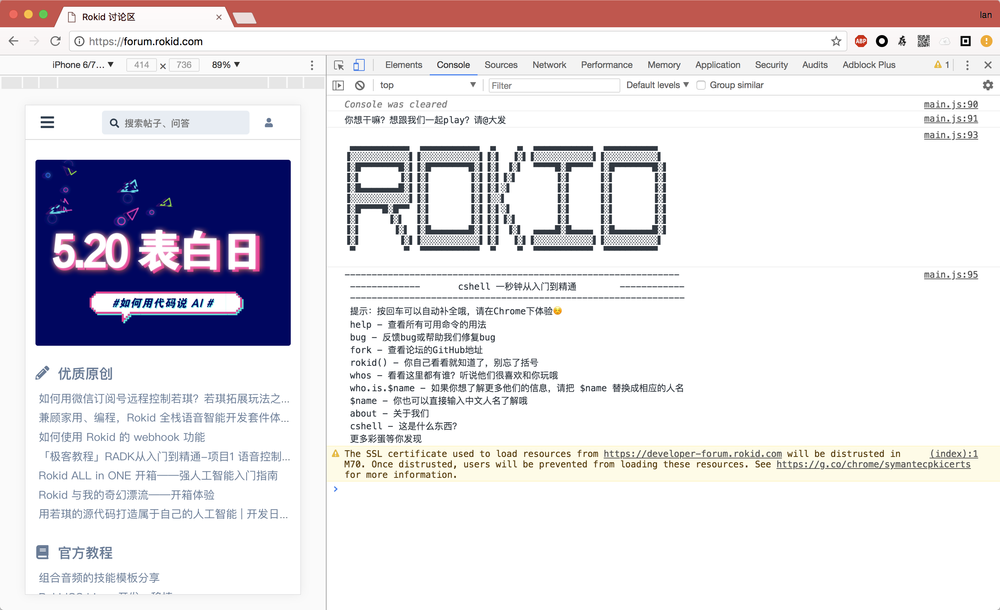

# Rokid NextForum

NextForum 是基于 Vue/Vuex 技术栈，对 Discourse 论坛前端的深度改造，界面优雅、功能丰富、小巧迅速。
是 Rokid 下一代开放社区论坛的前端技术架构。

> 新域名：forum.rokid.com

### 全新版本

PC端


移动端


当然，还有好玩的彩蛋，我们叫它 cshell，不来了解一下吗？



还有，遇到不支持浏览器的优雅的降级页面，你们自己发掘吧。

### 开发环境搭建

编辑你的 host 文件，加上 `127.0.0.1    forum-dev.rokid.com`

MacOS/Linux 系统直接

```sh
sudo vim /etc/hosts
```

windows系统

用记事本或文本编辑器编辑：`c:/windows/system32/drivers/etc/hosts`

### 启动

```sh
#不想用yarn，也可以用npm install
$ yarn

$ sudo npm run dev
```

### 贡献

任何意见或建议，欢迎提 [issues](issues/new)，你也可以直接 fork 然后提 PR

### 开放

我们将鼓励任何社区用户使用 Discourse API 进行任何客户端的开发，比如 iOS、安卓、React-Native 等。
具体接口可以访问 [Discourse Docs](http://docs.discourse.org/)，如果想跳过跨域限制，我们也提供
了 [node-http-bypass](https://github.com/Rokid/node-http-bypass) 工具，具体配置文件参考
[.bypassconfig](.bypassconfig)。

### License

MIT @ Rokid, Inc.
