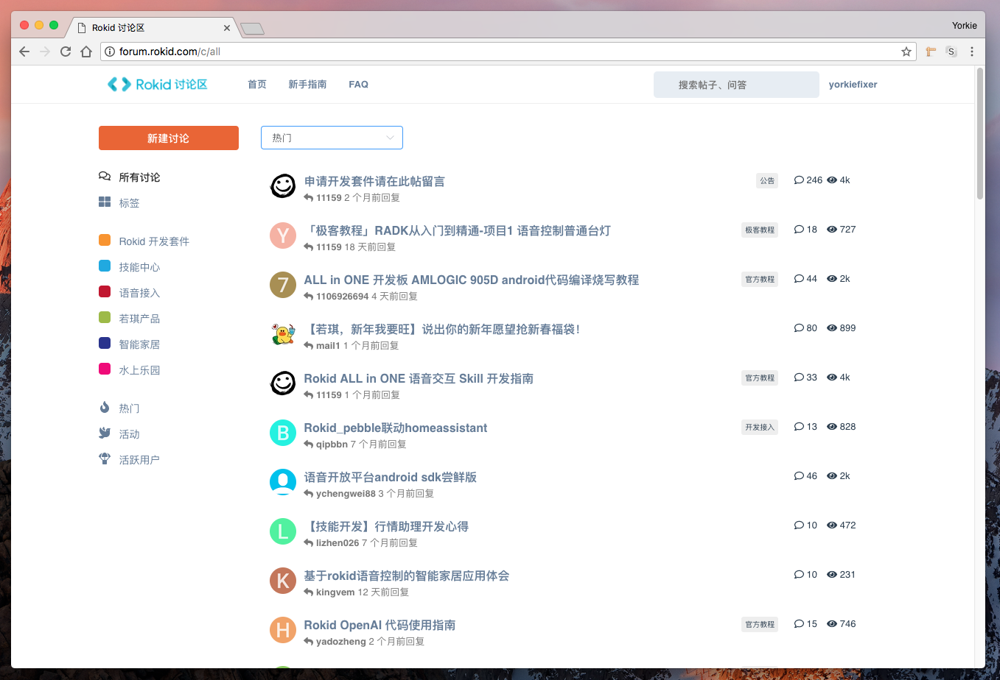

# Rokid NextForum

NextForum 是基于 Vue/Vuex 技术栈，对 Discourse 论坛前端的深度改造，界面优雅、功能丰富、小巧迅速。
是 Rokid 下一代开放社区论坛的前端技术架构。

> 新域名：敬请期待

[](screenshot.png)

### 本地运行

```sh
$ yarn
$ sudo npm run dev
```

### 贡献

任何意见或建议，欢迎提 [issues](issues/new)

### 开放

我们将鼓励任何社区用户使用 Discourse API 进行任何客户端的开发，比如 iOS、安卓、React-Native 等。
具体接口可以访问 [Discourse Docs](http://docs.discourse.org/)，如果想跳过跨域限制，我们也提供
了 [node-http-bypass](https://github.com/Rokid/node-http-bypass) 工具，具体配置文件参考
[.bypassconfig](.bypassconfig)。

### License

MIT @ Rokid, Inc.
